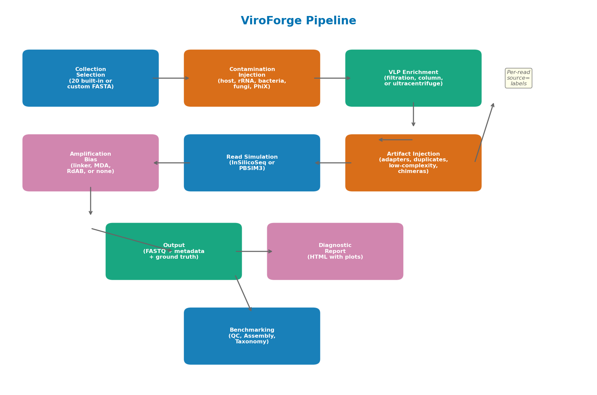
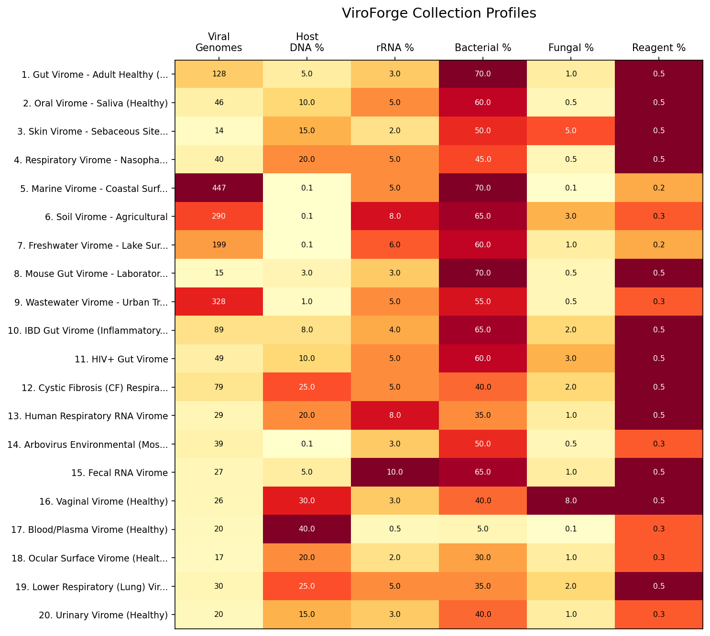

# ViroForge User Manual

ViroForge generates synthetic virome FASTQ datasets with known ground truth for benchmarking virome analysis pipelines.

---

## Table of Contents

1. [Pipeline Overview](#1-pipeline-overview)
2. [Collections](#2-collections)
3. [Database Structure](#3-database-structure)
4. [Installation](#4-installation)
5. [Commands](#5-commands)
6. [Understanding the Output](#6-understanding-the-output)
7. [Interpreting the Diagnostic Report](#7-interpreting-the-diagnostic-report)
8. [Use Case: IBD Gut Virome](#8-use-case-ibd-gut-virome)
9. [Quick Reference](#9-quick-reference)

---

## 1. Pipeline Overview

ViroForge simulates the full virome sequencing workflow, from sample preparation through read generation:

**Step 1 — Collection Selection:** Choose from 20 built-in virome collections (gut, skin, marine, etc.) or register your own custom genomes.

**Step 2 — Contamination Injection:** Add realistic non-viral contamination matching the body site: host DNA, ribosomal RNA, bacterial background, fungal background, reagent bacteria, and PhiX spike-in. Each collection has literature-informed contamination rates.

**Step 3 — VLP Enrichment:** Simulate virus-like particle enrichment to concentrate viruses and remove bacteria/host cells. Choose from filtration (0.1-0.45 um pore), ultracentrifugation, or column-based kits. Skip with `--no-vlp` for bulk metagenome simulation.

**Step 4 — Amplification Bias:** Model amplification effects (linker-based, MDA with phi29, or random-primed). MDA adds power-law duplicate distributions and chimeric reads.

**Step 5 — Read Simulation:** Generate paired-end Illumina reads (via InSilicoSeq) or long reads (PacBio HiFi / Nanopore via PBSIM3).

**Step 6 — Artifact Injection:** Add realistic sequencing artifacts: adapter read-through, PCR duplicates, low-complexity sequences, and MDA chimeras.

**Step 7 — Output:** FASTQ files with per-read ground truth labels (`source=viral`, `source=host_dna`, etc.), metadata JSON, and composition tables.

**Step 8 — Diagnostic Report:** An HTML report with plots showing dataset composition, community structure, and quality metrics.

**Step 9 — Benchmarking:** Score your analysis pipeline (QC, assembly, or taxonomy) against the known ground truth.

---

## 2. Collections

ViroForge includes 20 curated virome collections. Each has body-site-specific contamination profiles based on published literature.

The heatmap shows:
- **Viral Genomes**: number of curated viral genomes in each collection
- **Host DNA %**: fraction of host DNA contamination (high for blood/plasma, near zero for environmental)
- **rRNA %**: ribosomal RNA contamination
- **Bacterial %**: bacterial background that passes through VLP enrichment
- **Fungal %**: fungal/mycobiome background
- **Reagent %**: lab reagent ("kitome") contamination

These percentages represent the **pre-VLP composition**. After VLP enrichment, most contamination is removed (typically >90%), leaving a dataset dominated by viral reads.

### Collection Details

| ID | Collection | Genomes | Host | Body Site |
|----|-----------|---------|------|-----------|
| 1 | Gut Virome - Adult Healthy (Western Diet) | 134 | Human | Gut |
| 2 | Oral Virome - Saliva (Healthy) | 47 | Human | Oral |
| 3 | Skin Virome - Sebaceous Sites | 15 | Human | Skin |
| 4 | Respiratory Virome - Nasopharynx | 43 | Human | Respiratory |
| 5 | Marine Virome - Coastal Surface Water | 445 | None | Marine |
| 6 | Soil Virome - Agricultural | 290 | None | Soil |
| 7 | Freshwater Virome - Lake Surface Water | 200 | None | Freshwater |
| 8 | Mouse Gut Virome - Laboratory (C57BL/6) | 22 | Mouse | Gut |
| 9 | Wastewater Virome - Urban Treatment Plant | 352 | Human | Wastewater |
| 10 | IBD Gut Virome | 90 | Human | Gut |
| 11 | HIV+ Gut Virome | 55 | Human | Gut |
| 12 | CF Respiratory Virome | 79 | Human | Respiratory |
| 13 | Human Respiratory RNA Virome | 53 | Human | Respiratory |
| 14 | Arbovirus Environmental (Mosquito) | 39 | None | Environmental |
| 15 | Fecal RNA Virome | 46 | Human | Gut |
| 16 | Vaginal Virome (Healthy) | 26 | Human | Vaginal |
| 17 | Blood/Plasma Virome (Healthy) | 21 | Human | Blood |
| 18 | Ocular Surface Virome | 17 | Human | Ocular |
| 19 | Lower Respiratory (Lung) Virome | 31 | Human | Lung |
| 20 | Urinary Virome (Healthy) | 20 | Human | Urinary |

### Custom Collections

You can add your own genomes as a new collection:

    viroforge create-collection --genomes my_phages.fasta --name "My Virome" --body-site gut

The collection is registered in the database and can be used like any built-in collection. Contamination profiles are assigned automatically based on the body site.

---

## 3. Database Structure

ViroForge stores all data in a SQLite database (`viroforge/data/viral_genomes.db`, ~500 MB).

| Table | Records | Description |
|-------|---------|-------------|
| `genomes` | 14,423 | Viral genome sequences from RefSeq |
| `taxonomy` | 14,423 | ICTV/NCBI taxonomy (71.7% family, 88.9% class coverage) |
| `body_site_collections` | 20 | Collection metadata and contamination defaults |
| `collection_genomes` | ~2,000 | Genome-collection associations with abundances |
| `host_associations` | — | Phage-host mappings (not yet populated) |
| `ecological_metadata` | — | Environmental/sample metadata |

### Reference Files

Contamination reads are generated from bundled reference sequences:

| File | Sequences | Source |
|------|-----------|--------|
| `host_fragments.fasta` | 48 | Human genome (T2T-CHM13v2.0), 10 kb fragments |
| `rrna_representatives.fasta` | 23 | E. coli, human, gut bacteria 16S/18S/23S/28S |
| `bacterial_fragments.fasta` | 120 | Gut/oral/skin/marine bacteria from RefSeq |
| `fungal_fragments.fasta` | 15 | Common fungi (Candida, Saccharomyces, etc.) |
| `archaeal_fragments.fasta` | 15 | Gut archaea (Methanobrevibacter, etc.) |
| `phix174.fasta` | 1 | PhiX174 genome (NC_001422.1, 5,386 bp) |
| `adapters.fasta` | 11 | Illumina TruSeq and Nextera adapter sequences |

---

## 4. Installation

### Step 1: Clone and install

    git clone https://github.com/shandley/viroforge.git
    cd viroforge
    pip install -e .

### Step 2: Install the read simulator

    pip install InSilicoSeq

### Step 3: Build the database

    viroforge setup-db

This downloads RefSeq genomes, builds the SQLite database, and populates all 20 collections. Takes a few minutes, only needed once.

### Step 4: Verify

    viroforge browse

You should see 20 collections listed.

### Optional: Benchmarking support

    pip install mappy

Required only for assembly benchmarking.

### Optional: Long-read support

Install PBSIM3 for PacBio HiFi or Nanopore read simulation:

    conda install -c bioconda pbsim3

---

## 5. Commands

### Generate a dataset

    viroforge generate --collection-id 1 --output data/gut --seed 42

This is the core command. It generates FASTQ files with ground truth. Key options:

| Option | Description | Default |
|--------|-------------|---------|
| `--collection-id N` | Which collection to use (1-20) | Required |
| `--output DIR` | Output directory | Required |
| `--seed N` | Random seed for reproducibility | 42 |
| `--coverage N` | Coverage depth | 10 |
| `--platform NAME` | novaseq, miseq, hiseq, pacbio-hifi, nanopore | novaseq |
| `--vlp-protocol NAME` | VLP enrichment method | tangential_flow |
| `--no-vlp` | Skip VLP (bulk metagenome) | — |
| `--contamination-level` | clean, realistic, heavy, failed | realistic |
| `--amplification` | none, linker, rdab, mda | linker |
| `--molecule-type` | dna, rna | dna |
| `--adapter-rate N` | Adapter contamination fraction | 0.03 |
| `--duplicate-rate N` | PCR duplicate fraction | 0.10 |
| `--dark-matter-fraction N` | Unclassified viral fraction | 0.30 |
| `--dry-run` | Preview without generating reads | — |

### Generate from a preset

    viroforge generate --preset gut-standard --output data/gut

Available presets:

| Preset | Description |
|--------|-------------|
| `gut-standard` | Human gut virome, 30x, VLP |
| `gut-bulk` | Gut bulk metagenome (no VLP, 70% bacterial) |
| `gut-vlp` | Gut virome with VLP enrichment |
| `stool-clinical` | Clinical stool (high host DNA) |
| `marine-standard` | Marine coastal virome |
| `respiratory-rna` | Respiratory RNA virome |
| `assembly-high-coverage` | 100x coverage for assembly |
| `quick-test-short` | Quick test (tiny dataset) |
| `quick-test-long` | Quick long-read test |

### Create a custom collection

    viroforge create-collection --genomes my_phages.fasta --name "My Virome" --body-site gut

Options:

| Option | Description |
|--------|-------------|
| `--genomes FILE` | FASTA file of viral genomes (required) |
| `--name TEXT` | Collection name (required) |
| `--body-site TEXT` | Body site for contamination defaults (gut, skin, blood, etc.) |
| `--host TEXT` | Host organism name |
| `--abundances FILE` | TSV file with genome_id and abundance columns |
| `--host-genome FILE` | Host genome FASTA for accurate host DNA contamination |

### Browse collections

    viroforge browse

### Batch generation

    viroforge batch config.yaml --output-dir data/results
    viroforge batch config.yaml --output-dir data/results --parallel 4

### Benchmark QC

    viroforge benchmark qc --raw-reads data/gut/fastq/reads_R1.fastq --cleaned-reads cleaned.fastq

Scores: viral retention, contamination removal, false positive/negative rates.

### Benchmark assembly

    viroforge benchmark assembly --contigs assembly/contigs.fa --genomes data/gut/fasta/*.fasta --ground-truth data/gut/metadata/*_metadata.json

Scores: genome recovery, completeness, identity, chimeras, N50/L50.

### Benchmark taxonomy

    viroforge benchmark taxonomy --pipeline-output classification_results.txt --ground-truth data/gut/metadata/*_metadata.json

Auto-detects format for Kraken2, Kaiju, Centrifuge, DIAMOND, MMseqs2. For other tools:

    viroforge benchmark taxonomy --format generic --read-id-column 2 --taxid-column 4 --pipeline-output results.tsv --ground-truth data/gut/metadata/*_metadata.json

Scores: precision, recall, F1 at species/genus/family level, abundance profile comparison.

### Other commands

| Command | Description |
|---------|-------------|
| `viroforge report DIR` | View a dataset report |
| `viroforge compare DIR1 DIR2` | Compare two datasets |
| `viroforge presets list` | List all presets |
| `viroforge setup-db` | Build/rebuild the database |
| `viroforge web` | Launch the web interface |

---

## 6. Understanding the Output

After generation, the output directory contains:

| File | Description |
|------|-------------|
| `fastq/*_R1.fastq` | Forward reads |
| `fastq/*_R2.fastq` | Reverse reads (paired-end) |
| `fasta/*.fasta` | Source genomes and contaminants |
| `metadata/*_metadata.json` | Complete ground truth |
| `metadata/*_composition.tsv` | Genome abundance table |
| `metadata/*_manifest.tsv` | Artifact manifests |
| `generation_report.html` | Diagnostic report with plots |

### Ground truth labels

Every read header contains a `source=` tag identifying its origin:

| Label | Meaning |
|-------|---------|
| `source=viral` | Viral genome read |
| `source=host_dna` | Host DNA contamination |
| `source=rrna` | Ribosomal RNA |
| `source=bacterial_background` | Bacterial contamination |
| `source=fungal_background` | Fungal contamination |
| `source=phix` | PhiX spike-in control |
| `source=reagent_bacteria` | Lab reagent contamination |
| `source=dark_matter` | Unclassified viral genome |

---

## 7. Interpreting the Diagnostic Report

Open `generation_report.html` in your browser after generating a dataset.

### Composition Pie Chart

Shows the fraction of reads from each source type (viral, host DNA, rRNA, bacterial, etc.) after VLP enrichment. A well-enriched VLP virome should be >90% viral.

### Before vs After VLP

Side-by-side bar chart showing how VLP enrichment changed the composition. Before VLP: mostly bacterial. After VLP: mostly viral. This is the primary purpose of VLP enrichment.

### Top Viral Families

Horizontal bar chart showing the most abundant viral families. Check if the community structure makes sense for the body site (e.g., gut should be dominated by Caudovirales phages).

### Rank-Abundance Curve

Each dot represents one viral genome. The X axis is the genome's rank (1 = most abundant, 2 = second most, etc.). The Y axis (log scale) is what fraction of reads came from that genome.

- **Steep curve** = a few viruses dominate, most are rare (typical of real viromes)
- **Flat curve** = all viruses equally abundant (unusual in nature)

### GC Content Distribution

Histogram of GC content across all genomes. A skewed distribution could indicate amplification bias affecting the community.

### Genome Length vs Abundance

Scatter plot checking if genome size correlates with abundance. In an unbiased dataset, there should be **no trend** — just a random scatter. A visible pattern could indicate VLP size bias or amplification effects.

### VLP Contamination Reduction Table

Shows the removal efficiency for each contamination type. Typical values: >95% host DNA removal, >90% bacterial removal, ~40% PhiX loss (small virus, passes through filters).

### Artifact Summary Table

Shows how many reads were modified by each artifact injection step (adapters, duplicates, low-complexity, chimeras).

---

## 8. Use Case: IBD Gut Virome

This walkthrough demonstrates the full ViroForge workflow using the IBD (Inflammatory Bowel Disease) gut virome collection.

### Background

IBD patients show altered virome composition compared to healthy individuals: increased temperate phages, expanded Caudovirales diversity, and reduced virome stability. Collection 10 models this with 90 curated viral genomes reflecting published IBD virome studies.

The contamination profile for IBD gut is:

| Component | Percentage | Notes |
|-----------|-----------|-------|
| Viral genomes | 90 genomes | IBD-associated phages and eukaryotic viruses |
| Bacterial background | 65% | Dysbiotic gut microbiome |
| Host DNA | 8% | Higher than healthy gut (inflamed mucosa) |
| rRNA | 4% | Ribosomal RNA from gut bacteria |
| Fungal | 2% | Increased in IBD (Candida expansion) |
| Reagent | 0.5% | Lab kit contamination |
| PhiX | 0.1% | Sequencing spike-in |

### Step 1: Generate the dataset

    viroforge generate --collection-id 10 --output data/ibd_virome --coverage 10 --seed 42

This takes about 10 minutes and produces:
- ~400,000 paired-end reads (R1 + R2)
- Ground truth labels on every read
- Metadata JSON with complete provenance
- Diagnostic report

### Step 2: Review the diagnostic report

Open `data/ibd_virome/generation_report.html` in your browser. Check:

- **Composition pie chart**: After VLP enrichment, the dataset should be >93% viral with small fractions of residual contamination
- **Top viral families**: Should show Caudovirales families (Siphoviridae, Myoviridae) and potentially Microviridae, reflecting IBD-associated phage communities
- **Rank-abundance curve**: Expect a steep curve — a few dominant phages (like crAssphage) with a long tail of rare viruses
- **VLP reduction table**: Host DNA reduced from 8% to <0.3%, bacterial from 65% to <3%

### Step 3: Run your analysis pipeline

Use the generated FASTQ files as input to your virome analysis pipeline. For example:

**QC step:**

    fastp -i data/ibd_virome/fastq/*_R1.fastq -I data/ibd_virome/fastq/*_R2.fastq -o cleaned_R1.fastq -O cleaned_R2.fastq

**Classification step:**

    kraken2 --db viralDB data/ibd_virome/fastq/*_R1.fastq --output kraken_results.txt

**Assembly step:**

    megahit -1 data/ibd_virome/fastq/*_R1.fastq -2 data/ibd_virome/fastq/*_R2.fastq -o assembly/

### Step 4: Benchmark your results

Score each step of your pipeline against ViroForge's ground truth:

    viroforge benchmark qc --raw-reads data/ibd_virome/fastq/*_R1.fastq --cleaned-reads cleaned_R1.fastq

    viroforge benchmark taxonomy --pipeline-output kraken_results.txt --ground-truth data/ibd_virome/metadata/*_metadata.json

    viroforge benchmark assembly --contigs assembly/final.contigs.fa --genomes data/ibd_virome/fasta/*.fasta --ground-truth data/ibd_virome/metadata/*_metadata.json

### Step 5: Compare conditions

Generate a matched healthy gut virome to compare IBD vs healthy:

    viroforge generate --collection-id 1 --output data/healthy_gut --coverage 10 --seed 42
    viroforge compare data/ibd_virome data/healthy_gut

This reveals how your pipeline performs differently on disease vs healthy viromes — for example, whether rare IBD-associated phages are missed at low abundance.

### What you learn

From this workflow you can answer:
- **QC**: Does my QC tool correctly remove the 8% host DNA without losing viral reads?
- **Taxonomy**: Can my classifier identify the IBD-associated viral families?
- **Assembly**: Does my assembler recover the 90 viral genomes? At what completeness?
- **Comparison**: Does my pipeline perform differently on IBD vs healthy samples?

---

## 9. Quick Reference

### Key Defaults

| Parameter | Default |
|-----------|---------|
| Platform | NovaSeq (Illumina) |
| Coverage | 10x |
| VLP protocol | Tangential flow filtration (0.2 um) |
| Contamination level | Realistic (1x baseline) |
| Amplification | Linker-based (least bias) |
| Adapter rate | 3% |
| Duplicate rate | 10% |
| Low-complexity rate | 0.5% |
| Dark matter fraction | 30% |
| Seed | 42 |

### Getting Help

    viroforge --help
    viroforge generate --help
    viroforge benchmark --help

---

*ViroForge Development Team | [GitHub](https://github.com/shandley/viroforge)*
